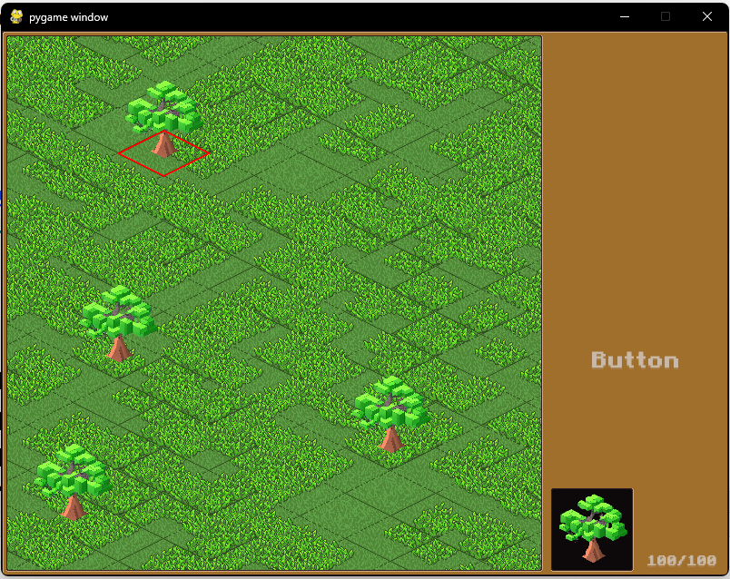

# GB-PythonProjects

This repository contains the code for a game engine developed in Python. The engine provides various classes and components for creating and managing game objects, rendering graphics, handling user input, and more.

## Table of Contents

- [Classes](#classes)
- [Getting Started](#getting-started)
- [Usage](#usage)
- [Examples](#examples)
- [Contributing](#contributing)

## Classes

- `Component`: A general class for game components.
- `ComponentHolder`: A class for managing an array of components.
- `GameObject`: Represents a game object with components.
- `Background`: Represents non-game objects in the background.
- `Transform`: Represents the size and position of objects.
- `Sprite`: Handles routines for displaying sprites on the screen.
- `Text`: Handles routines for displaying text elements in the game.
- `Camera`: Handles general camera functionality and player view tracking.
- `Render`: Manages rendering of objects on the screen.
- `OnClick`: Handles assignment and control of click events.
- `Collider2D`: Represents a rectangular collider for collision detection.
- `Game`: The main class controls the game and game window.
- `MapObject`: Used to create objects with names and essential information.
- `Tile`: Represents background map elements that act as obstacles.
- `Chunk`: Represents sets of tiles and handles the division of responsibilities.
- `Icon`: A simple class for displaying images on the UI layout.
- `TextUI`: Handles text elements specifically for UI layout.
- `Button`: Represents clickable objects on the UI layout.

## Getting Started

To use this game engine, follow these steps:

1. Clone the repository: `git clone <repository-url>`
2. Install the required dependencies: `pip install pygame`
3. Import the necessary classes into your project from the `game.py`, `components.py`, `tile.py`, and `mapObject.py` files.
4. Create instances of the classes and use them to build your game.

## Usage

To use the game engine, you can import the necessary classes and create game objects with specific components. Here's a simple(old) example:

```python
# PLEASE CHECK main.py FILE TO SEE MORE UPDATED STATE OF GAME CREATION AND RECENT EXAMPLES OF CODE USAGE

import pygame
from game import Game
from components import GameObject, Transform, Sprite
# ...

# Create a game object with a transform component and a sprite component
game_object = GameObject()
game_object.addComponent(Transform((100, 100)))
game_object.addComponent(Sprite("tree", (32, 32)))

# Initialize the game
game = Game((800, 600))
# ...

# Run the game
game.run()
```

## Examples

You can find examples of usage of the game engine in the examples directory.

### Game Window

Here is an example of how the game window looks:




## Contributing
 
Contributions to the game engine are welcome! If you find any issues or have suggestions for improvements, please open an issue or submit a pull request.
